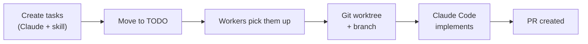

# The Stuff

A task manager for agent swarms. Kanban board for humans, REST API for Claude Code agents.


## Why "The Stuff"

I always have a project called "stuff" where I dump the tasks I need to do. I wanted something like that, but where a swarm of Claude Code agents could pick up tasks and implement them autonomously. I could have learned an existing framework, but I'm lazy, building it is more fun, and the result fits exactly how I work.

This is a toy project for local development. If you need something production-grade for agent orchestration, more serious tools exist. This one is just for me — and now you, if you want it.

## How it works



You create tasks using Claude Code with the included skill. Move them to TODO when they're ready. Worker agents poll for tasks, spin up isolated git worktrees, implement the work, and open PRs. You review and merge.

## Prerequisites

- Node.js 18+
- Git
- [GitHub CLI](https://cli.github.com/) (`gh`) — used by the worker to create PRs
- [Claude Code](https://docs.anthropic.com/en/docs/claude-code) — used by the worker to process tasks

## Setup

```bash
git clone <repo-url> && cd the-stuff
npm install
npm run db:push   # create the SQLite database
npm run dev       # start the dev server at http://localhost:3000
```

The database is stored at `./data/the-stuff.db` (auto-created on first run). No environment variables needed — see `.env.example` for optional config.

## Install the skill

The repo ships a Claude Code skill that lets Claude manage tasks and projects via the API. To use it from any project:

```bash
mkdir -p ~/.claude/skills
ln -s "$PWD/.claude/skills/the-stuff" ~/.claude/skills/the-stuff
```

Once linked, you can ask Claude to create tasks, list projects, update statuses — all through natural language.

## Create and dispatch tasks

Ask Claude to create tasks in your project (or use the Kanban board at localhost:3000). Tasks start as drafts. When you're ready to dispatch work, move them to **TODO** — that's the signal for workers to pick them up.

## Spawn workers

```bash
export PATH="$PWD/bin:$PATH"
the-stuff-worker
```

It'll prompt you to pick a project, then start polling for TODO tasks. Run as many workers as you want in parallel — each task gets its own git worktree.

<details>
<summary>Advanced options</summary>

```bash
the-stuff-worker <project-id> \
  --server http://localhost:3000 \
  --base-branch main \
  --max-tasks 10 \
  --poll-interval 30
```

Or set `THE_STUFF_URL` to point at a different server:

```bash
THE_STUFF_URL=http://my-server:3000 the-stuff-worker 1
```

</details>

## What happens next

Workers grab TODO tasks, create branches, run Claude Code to implement them, and open PRs. The task moves to DONE, the PR shows up on the board. You review, merge, repeat.
