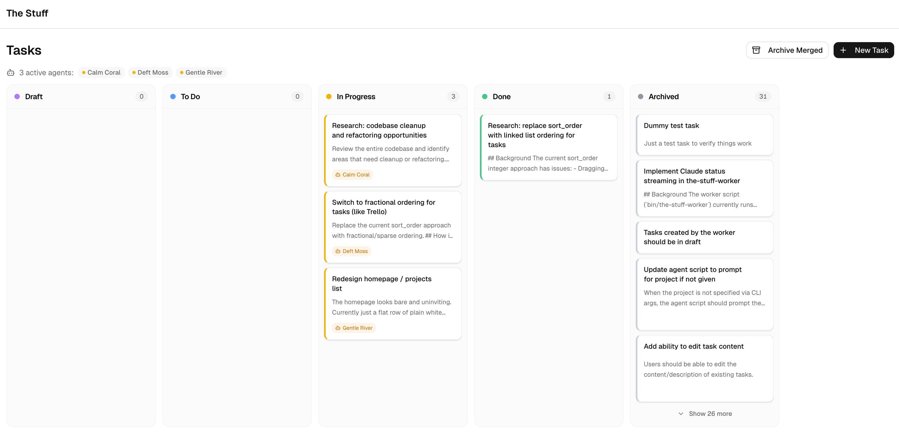

# The Stuff

Distribute work to Claude agents.



## TL;DR

```bash
# 1. Install
npm install
npm run db:push
ln -s "$PWD/.claude/skills/the-stuff" ~/.claude/skills/the-stuff

# 2. Run
npm run dev
```

Then:

3. Create a project on the board
4. Spawn agents from the repo you want them to work in: `cd /path/to/your-repo && the-stuff-worker`
5. Ask Claude to create tasks ("create a task to…")
6. Move them to **TODO** to dispatch
7. Ask Claude to review and merge the PRs

## Why "The Stuff"

I always have a project called "stuff" where I dump the tasks I need to do. I wanted something similar, but where a swarm of Claude Code agents could pick up tasks and implement them autonomously. I could have learned an existing framework, but I'm lazy, building it is more fun, and the result fits exactly how I work.

This is a toy project for local development. If you need something production-grade for agent orchestration, more serious tools exist.

## How it works

Tasks start as drafts. Moving one to **TODO** is the dispatch signal — a worker picks it up, spins up an isolated git worktree, runs Claude Code to implement the change, and opens a PR. You review and merge.

A few things worth knowing:

- **Statuses.** Poor wording, but: **Done** means the PR has been opened, **Archived** means the PR has been merged.
- **Dependencies.** A task with unresolved prerequisites won't be picked up until they're archived (i.e. merged).
- **Research tasks.** Some tasks are plan-only: the agent stays in plan mode, writes no code, and spawns follow-up tasks instead of opening a PR.
- **Session reuse.** Agents reuse the same Claude session across a handful of tasks, so context carries over.

## Prerequisites

- Node.js 18+
- Git
- [GitHub CLI](https://cli.github.com/) (`gh`) — used by the worker to create PRs
- [Claude Code](https://docs.anthropic.com/en/docs/claude-code) — used by the worker to process tasks

## Setup

```bash
git clone <repo-url> && cd the-stuff
npm install
npm run db:push   # create the SQLite database
npm run dev       # start the dev server at http://localhost:3000
```

The database is stored at `./data/the-stuff.db` (auto-created on first run).

## Install the skill

The repo ships a Claude Code skill that lets Claude manage tasks and projects via the API. To use it from any project:

```bash
mkdir -p ~/.claude/skills
ln -s "$PWD/.claude/skills/the-stuff" ~/.claude/skills/the-stuff
```

Once linked, you can ask Claude to create tasks, list projects, update statuses — all through natural language.

## Spawn workers

```bash
# Add to your .zshrc — replace $PWD with the absolute path to this repo
export PATH="$PWD/bin:$PATH"
the-stuff-worker
```

It'll prompt you to pick a project, then start polling for TODO tasks.

<details>
<summary>Advanced options</summary>

```bash
the-stuff-worker <project-id> \
  --server http://localhost:3000 \
  --base-branch main \
  --max-tasks 10 \
  --poll-interval 30
```

Or set `THE_STUFF_URL` to point at a different server:

```bash
THE_STUFF_URL=http://my-server:3000 the-stuff-worker 1
```

</details>
